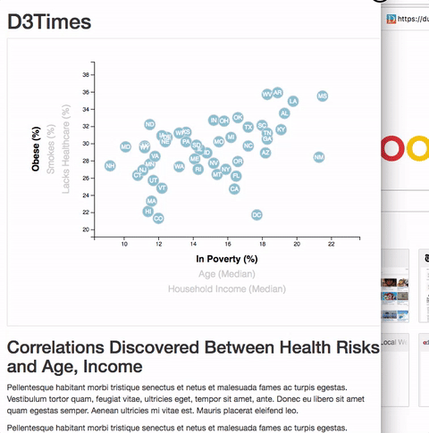

## Project Description

In this project, I will investigate a dataset based on 2014 ACS 1-year estimates from the [US Census Bureau](https://data.census.gov/cedsci/). THis dataset includes data on rates of income, obesity, poverty, etc. by state. I will look for patterns about the health risks facing particular demographics.

## Features & Libraries

* Python
* HTML
* CSS
* JSON
* Javascript
* D3

## My Process

1. Create a scatter plot between two of the data variables.
2. Create a scatter plot that represents each state with circle elements using D3. 
3. Bind CSV data to the circles. 
4. Place additional labels in the scatter plot and give them click events so that users can decide which data to display.
5. Add tooltips to the circles and display each tooltip with the data that the user has selected.
6. Code this graphics in the `app.js` file.

## Screenshots

### Tooltip Feature

### Window Size Responsiveness
